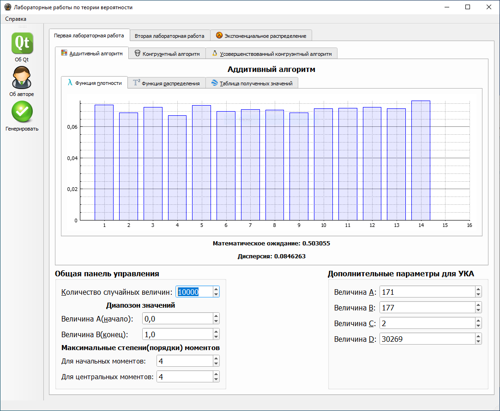
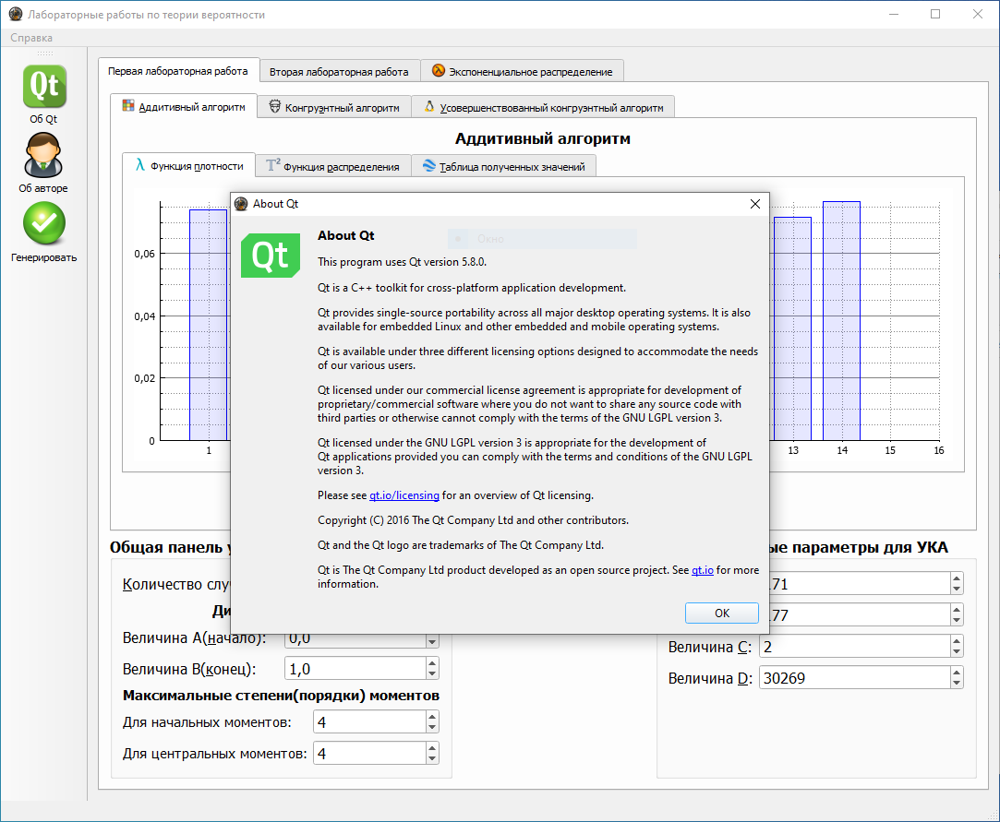
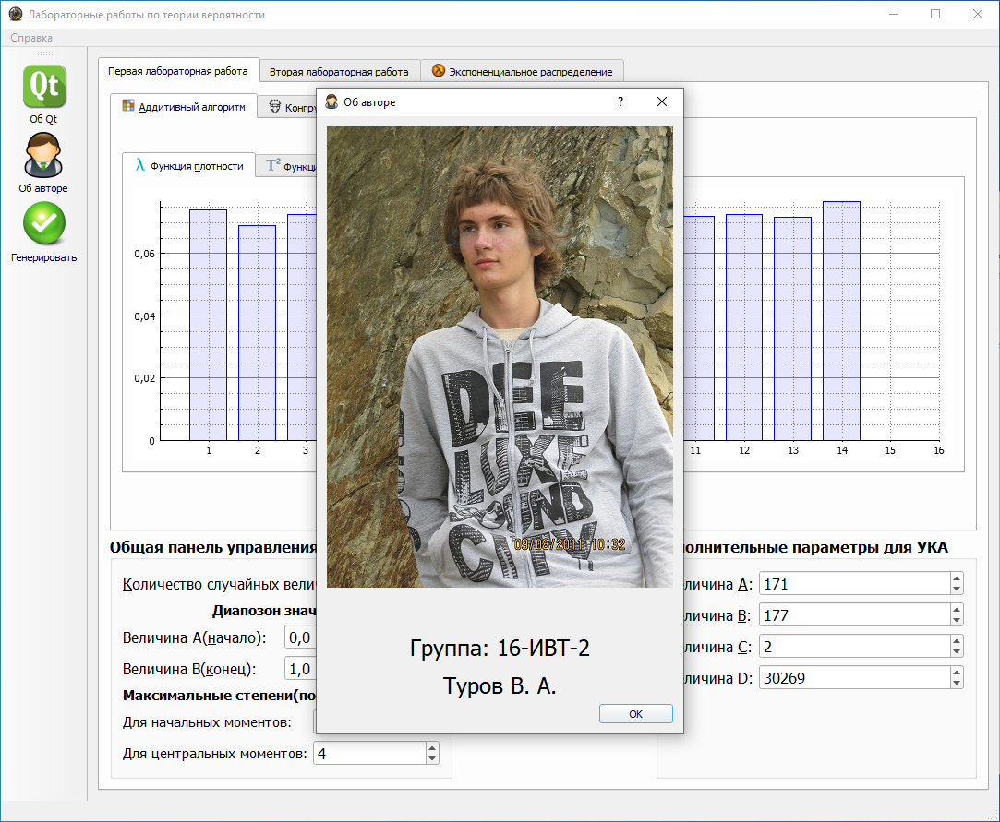
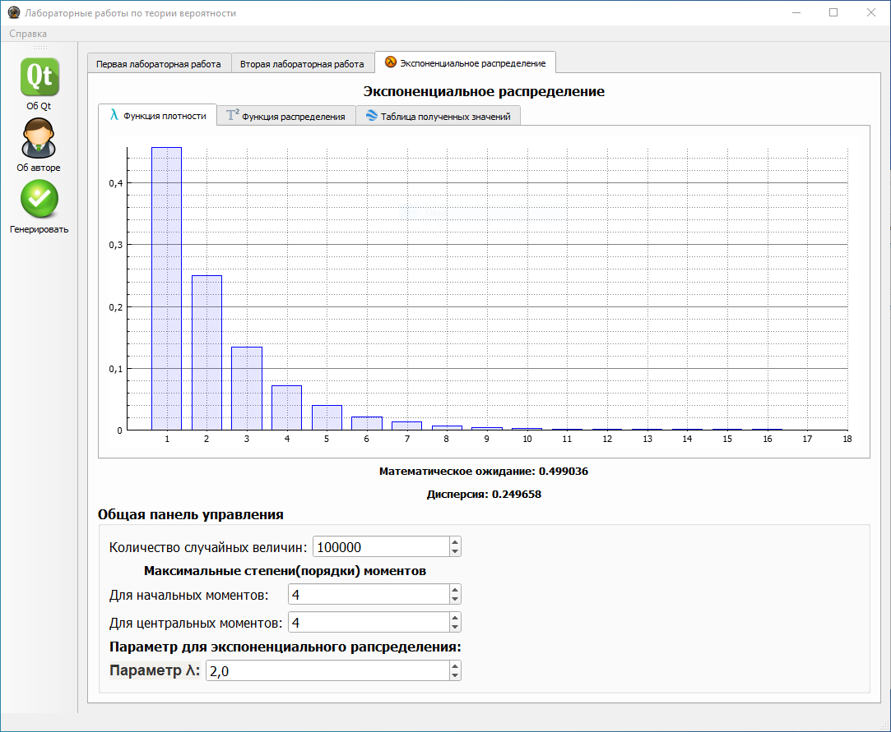
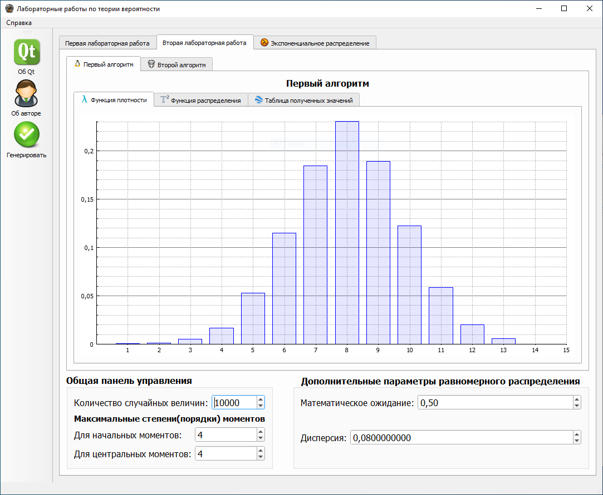

# Probability-theory.-Laboratory-work.-Qt
Probability theory. Laboratory work. Qt
[Report](https://disk.yandex.ru/i/58xUeDsQtDTAtQ)
 
[Windows program](https://disk.yandex.ru/d/3Ac4bKyj3Pm5s9)

